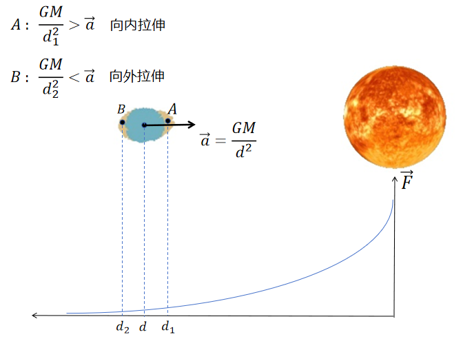
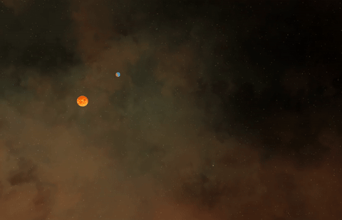

# TidalForceSimulator

## 项目概要

本项目基于 CUDA 与 OpenGL，实现了天体在潮汐力作用下逐步解体并形成星环的物理过程模拟。系统支持多体引力计算、刚体碎片化模拟以及实时可视化渲染。

在引力场中，万有引力随着距离的平方反比衰减。当具有一定体积的天体处于强引力源附近时，其靠近和远离引力源的两侧所受的引力大小不同，产生潮汐力。该潮汐力对天体产生撕扯作用，一旦超过其结构极限，便会导致天体解体，碎片在轨道上重新分布，最终可能形成类似星环的结构。



## 目录结构
```plaintext
TidalForceSimulator
├── CMakeLists.txt     # 构建脚本
├── include/           # 头文件目录
├── src/               # 源代码目录（.cpp, .cu）
├── Render/            # 渲染相关代码和着色器
│   └── glsl/          # GLSL 着色器文件
├── lib/               # 第三方库 (.lib/.dll)
│   ├── glfw3.dll
│   ├── glew32.dll
│   └── ...
└── build/             # 构建输出目录（由 CMake 生成）

```

## 依赖环境

- **CMake** ≥ 3.18
- **C++14**
- **CUDA**
- **OpenGL  (GLFW, GLEW, GLM)**

## 构建项目：
- **CMake构建**
```bash
git clone https://github.com/pph-hpp/TidalForceSystem.git
mkdir build
cd build
cmake ..

```
## 运行示例
W/A/S/D：移动视角

鼠标拖拽：旋转视图

- **行星逐渐解体形成星环**


- **行星掠过恒星附近**
